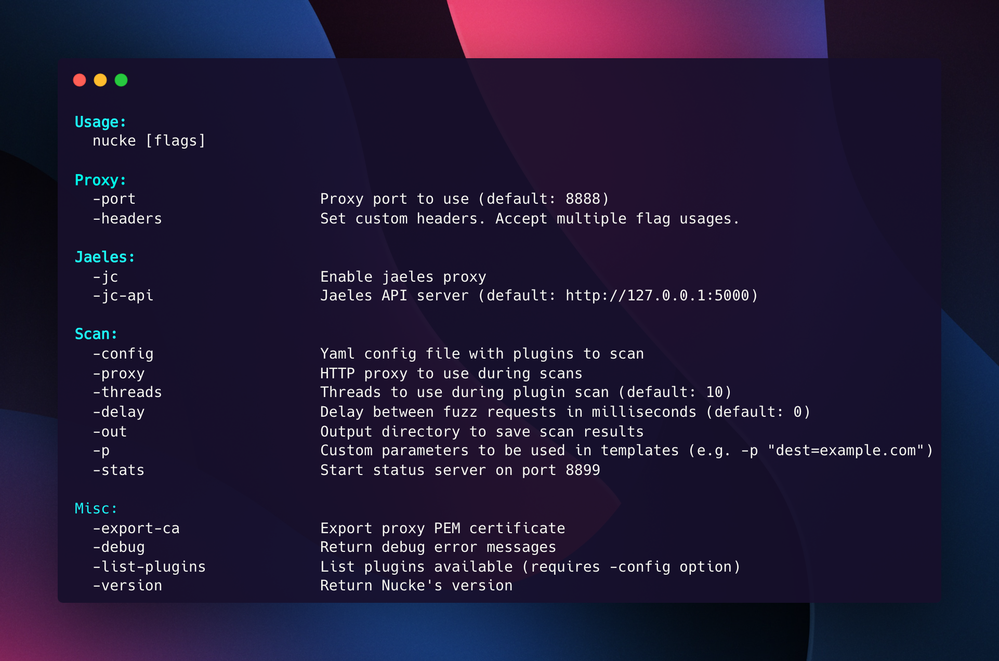

# Usage - Full usage message



## Practical Usage with examples commands

```bash
# Start a simple proxy server
nucke

# Load configuration file for plugin scan
nucke -config config.yaml

# Send to another proxy the plugin scan requests
nucke -config config.yaml -proxy "http://127.0.0.1:8080"

# Scan with plugins and save output directory
nucke -config config.yaml -out report

# Set threads to scan (concurrency of urls to be scanned)
nucke -config config.yaml -threads 50

# Start proxy server and redirect requests to jaeles API
nucke -jc -jc-api "http://jaeles-server:5000"

# Export CA certificate to install locally/in browser
nucke -export-ca

# Return debug error messages and requests received
nucke -debug -v

# Add custom headers
nucke -headers "User-Agent: example" -headers "X-Forwarded-For: example.com"

# Start "status" server to get scan information (http://localhost:8899)
nucke -config config.yaml -stats
```
