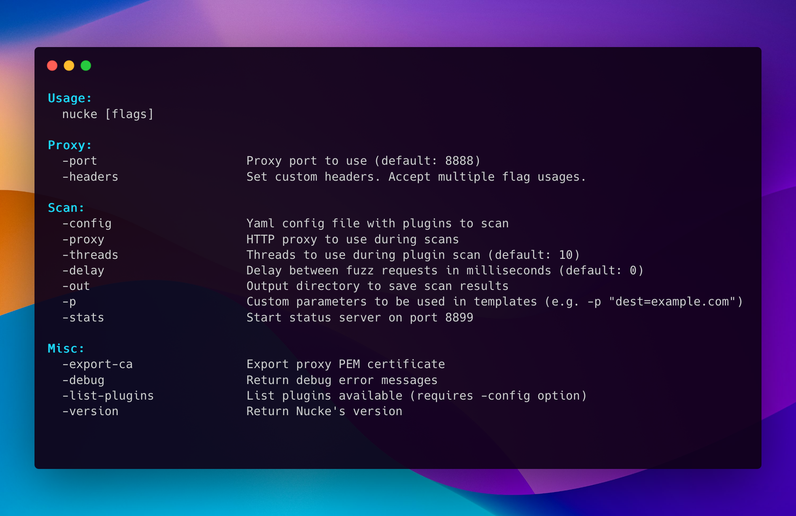

# Usage - Full usage message



## Practical Usage with examples commands

```bash
# Start a simple proxy server
nucke

# Start proxy server and redirect requests to jaeles API
nucke -jc -jc-api "http://jaeles-server:5000"

# Filter the targets to be scanned by regex
nucke -scope ".*example\.com" -jc

# Load configuration file for plugin scan
nucke -config config.yaml

# Send to another proxy the plugin scan requests
nucke -config config.yaml -proxy "http://127.0.0.1:8080"

# Scan with plugins and save output directory
nucke -config config.yaml -out report
```
