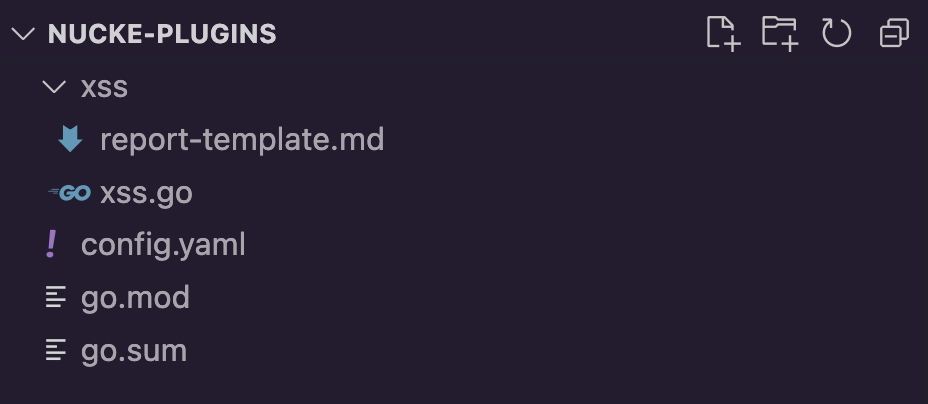
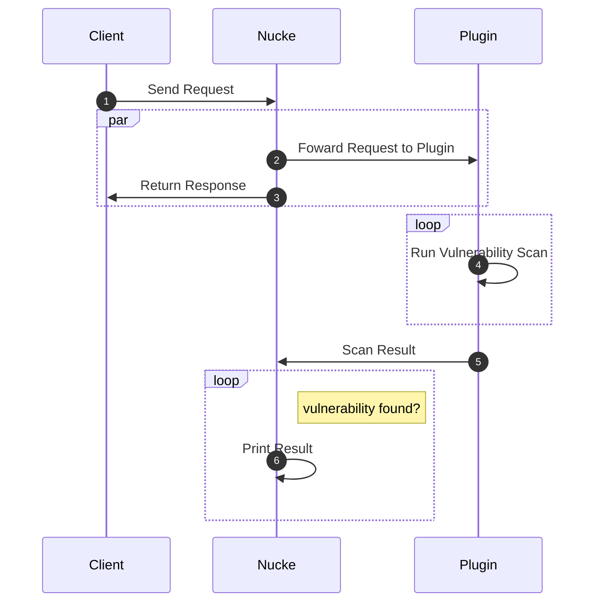

!!! info "Plugins"
    The plugins are written using [Go](https://go.dev/) programming language.

## Set up Environment

Before start creating the plugins, you must set up the environment.

Let's first create the plugins' directory and install all required dependencies:

```bash
mkdir nucke-plugins && cd nucke-plugins
go mod init nucke-plugins
go get github.com/cfsdes/nucke@latest
```

Next, you can create other directories and write your plugins into them. For example:



### **Updating Nucke**

If nucke version is greater than the current version of go.mod, you must update it manually running the following commands:
```
go get github.com/cfsdes/nucke@latest
go mod tidy
```

## Specifications

A plugin code must have a `Run()` function. This function will be called by Nucke for each request received. It is the entrypoint to run the scan:

```go
func Run(r *http.Request, client *http.Client, pluginDir string) (
    severity string, 
    url string, 
    summary string, 
    vulnFound bool, 
    rawResp string,
    err error
) {
    // Scan logic here!
}
```

???+ info "Returns"

    The `Run()` function should return:
    
    | Variable    | Description                          |
    | ----------- | ------------------------------------ |
    | `severity`  | Severity of the vulnerability. Should be ***Critical***, ***High***, ***Medium***, ***Low*** or ***Info***  |
    | `url`       | Vulnerable URL found |
    | `summary`   | Report of the vulnerability |
    | `vulnFound` | Boolean value. If ***true***, Nucke will report the vulnerability |
    | `rawResp`   | Raw Response |
    | `error`     | Error exception


??? example "Example: Plugin SQL Injection"
    ```go
    package main

    import (
        "net/http"
        "github.com/cfsdes/nucke/pkg/report"
        "github.com/cfsdes/nucke/pkg/plugins/fuzzers"
        "github.com/cfsdes/nucke/pkg/plugins/detections"
    )

    // SQL Injection scan
    func Run(r *http.Request, client *http.Client, pluginDir string) (
        string, // severity
        string, // url
        string, // summary (report content)
        bool,   // vuln found
        string, // raw response
        error,  // error
    ) {

        // Scan
        vulnFound, rawReq, url, rawResp := scan(r, client, pluginDir)

        // Report
        reportContent := report.ReadFileToString("report-template.md", pluginDir)
        summary := report.ParseTemplate(reportContent, map[string]interface{}{
            "request": rawReq,
        })
        
        return	"High", url, summary, vulnFound, rawResp, nil
    }


    func scan(r *http.Request, client *http.Client, pluginDir string) (vulnFound bool, rawReq string, url string, rawResp string) {
        
        // Set payloads and match rule
        payloads := []string{"'", "1 OR 1=1"}

        // Detection Rule
        matcher := detections.Matcher{
            Body: &detections.BodyMatcher{
                RegexList: []string{"SQL Syntax"},
            },
        }

        // Fuzzing all query parameters
        vulnFound, rawReq, url, _, _, rawResp, _ = fuzzers.FuzzQuery(r, client, payloads, matcher)

        return
    }
    ```

## Plugin Workflow

Below is a representation of the plugin workflow and the phases that Nucke interacts with it. 



## Directory Structure

The plugin created can be placed in any directory to use further in the `config.yaml` file.

???+ example "Example: Plugin Directory"

    ```
    ./custom-plugins/
        .. ssrf/
            .. ssrf.go
            .. report-template.md

        .. sqli/
            .. sqli.go
            .. report-template.md
    ```

???+ example "Example: `config.yaml`"
    ```yaml
    scope: ".*example\.com"
    plugins:
    - name: Injection
      path: ./custom-plugins/
      ids:
      - sqli
      - ssrf
    ```
